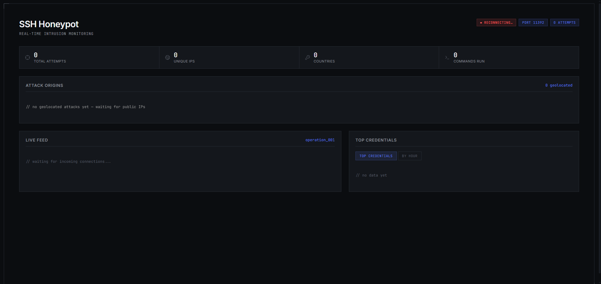

# SSH Honeypot Dashboard

Panel de monitorización en tiempo real para un honeypot SSH: un servidor SSH falso que captura credenciales y comandos de atacantes (bots y humanos) que intentan acceder a él, y los visualiza en vivo en un dashboard web.

## Qué hace

- Simula un servidor SSH real en un puerto expuesto a internet
- Captura usuario, contraseña, IP y comandos de cada intento de conexión
- Si las credenciales coinciden con combinaciones comunes (`admin/admin`, `root/root`...), deja "entrar" al atacante a una shell falsa interactiva, y registra qué comandos ejecuta
- Geolocaliza cada IP atacante
- Retransmite cada evento en tiempo real (WebSockets) a un dashboard web con mapa, feed en vivo y gráficas

## Arquitectura

```
┌─────────────┐     POST /events      ┌──────────────┐     WebSocket      ┌──────────────┐
│  Honeypot   │ ────────────────────> │   Backend    │ ─────────────────> │   Frontend   │
│  (paramiko) │                       │  (FastAPI)   │                    │   (React)    │
└─────────────┘                       └──────┬───────┘                    └──────────────┘
   Puerto 2222                               │
   (SSH falso)                          SQLite (server.db)
                                              │
                                        ip-api.com
                                     (geolocalización)
```

El honeypot y el backend están deliberadamente separados: el honeypot **nunca** escribe directamente en la base de datos, para evitar accesos concurrentes desde dos procesos distintos a un mismo fichero SQLite. Todo pasa por el backend, que centraliza escritura, geolocalización y difusión en tiempo real.

## Stack técnico

| Capa | Tecnología |
|---|---|
| Honeypot | Python, [paramiko](https://www.paramiko.org/) (implementación del protocolo SSH) |
| Backend | FastAPI, WebSockets nativos, SQLite |
| Geolocalización | [ip-api.com](https://ip-api.com/) |
| Frontend | React + Vite, react-leaflet (mapa), Recharts (gráficas), lucide-react (iconos) |
| Infra de demo | GitHub Actions + [bore.pub](https://bore.pub/) (túnel TCP) |

## Cómo ejecutarlo en local

Requiere Python 3.11+, Node.js 18+, y un cliente SSH para probar el honeypot.

```bash
# 1. Backend
cd backend
pip install -r ../requirements.txt
uvicorn main:app --reload --port 8000

# 2. Honeypot (en otra terminal)
cd server
python server.py

# 3. Frontend (en otra terminal)
cd frontend
npm install
npm run dev
```

Con todo levantado, prueba a conectarte al honeypot desde una terminal distinta:

```bash
ssh test@localhost -p 2222
```

Cualquier usuario/contraseña queda registrado. Probando `admin/admin`, `root/root`, `root/toor` o `admin/password` se accede a la shell falsa.

## Cómo se probó con tráfico real

Sin disponer todavía de una VPS propia, el proyecto se expuso temporalmente a internet usando GitHub Actions como entorno de ejecución y [bore.pub](https://bore.pub/) para abrir un túnel TCP público hacia los puertos del honeypot y del backend. Esto permitió capturar durante varias horas intentos de conexión reales de bots que escanean internet automáticamente en busca de servidores SSH mal protegidos.

## Decisiones de diseño relevantes

- **Consultas parametrizadas** en todas las operaciones SQL, para evitar inyección SQL incluso cuando los datos de entrada (contraseñas de atacantes) son deliberadamente maliciosos.
- **Timeouts en todas las llamadas de red externas** (geolocalización, comunicación honeypot→backend), para que un servicio de terceros lento o caído no bloquee indefinidamente una conexión SSH activa.
- **Autenticación siempre fallida por defecto**, salvo credenciales explícitamente incluidas en una lista controlada — nunca se ejecuta código ni se abre una shell real.
- **Rutas basadas en la ubicación del propio fichero** (`__file__`) en vez de rutas relativas al directorio de ejecución, para que el proyecto funcione igual sin importar desde dónde se lance.

## Estructura del repositorio

```
security-dashboard/
├── server/       # Honeypot SSH (paramiko)
├── backend/      # API FastAPI + WebSocket
├── frontend/     # Dashboard React
└── db/           # SQLite (generado automáticamente, no versionado)
```

## Posibles mejoras futuras

- Despliegue permanente en una VPS con IP fija (créditos de estudiante, septiembre 2026)
- Alertas por Telegram ante picos de actividad
- Soporte para más protocolos honeypot (HTTP, FTP)
- Base de datos externa (Postgres/Supabase) para persistencia entre sesiones de demo

## Autor

Sergio — [GitHub](https://github.com/SGC11PRO)
